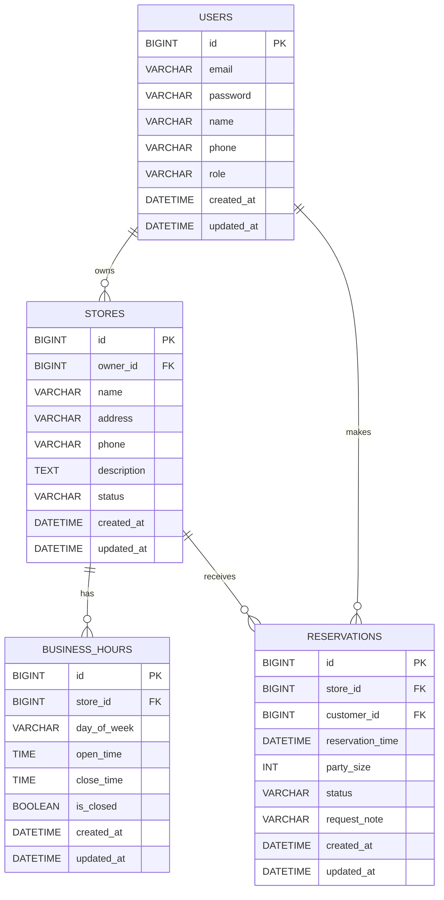

# MatGourmand MVP ERD

## 목표

이 ERD는 MVP를 위한 가벼운 백엔드 우선 초안입니다.

- 매장 등록과 예약 흐름에 필요한 엔티티부터 시작합니다.
- 첫 버전은 Spring Boot에서 빠르게 구현할 수 있을 정도로 작게 유지합니다.
- 핵심 흐름이 안정되면 리뷰, 메뉴, 결제, AI 관련 테이블을 나중에 추가합니다.

## 범위

초기 백엔드 범위:

- 사용자 가입 및 역할 분리
- 매장 등록 및 관리
- 매장 운영시간 관리
- 예약 생성 및 조회

## 핵심 엔티티

### users

목적:
사장과 고객을 하나의 테이블에 저장하고 `role`로 구분합니다.

컬럼:

- `id` `BIGINT` PK
- `email` `VARCHAR(255)` unique not null
- `password` `VARCHAR(255)` not null
- `name` `VARCHAR(100)` not null
- `phone` `VARCHAR(30)` null
- `role` `VARCHAR(30)` not null
- `created_at` `DATETIME` not null
- `updated_at` `DATETIME` not null

메모:

- `role`은 `OWNER`, `CUSTOMER` 같은 값으로 시작할 수 있습니다.
- 인증은 나중에 JWT를 붙여도 테이블 변경이 크지 않도록 구성했습니다.

### stores

목적:
사장이 등록한 식당 또는 매장을 표현합니다.

컬럼:

- `id` `BIGINT` PK
- `owner_id` `BIGINT` FK -> `users.id`
- `name` `VARCHAR(150)` not null
- `address` `VARCHAR(255)` not null
- `phone` `VARCHAR(30)` null
- `description` `TEXT` null
- `status` `VARCHAR(30)` not null
- `created_at` `DATETIME` not null
- `updated_at` `DATETIME` not null

메모:

- `status`는 `OPEN`, `CLOSED`, `HIDDEN` 같은 값으로 시작할 수 있습니다.
- 첫 버전에서는 한 명의 사장이 여러 매장을 관리할 수 있게 둡니다.

### business_hours

목적:
매장별 주간 운영시간을 저장합니다.

컬럼:

- `id` `BIGINT` PK
- `store_id` `BIGINT` FK -> `stores.id`
- `day_of_week` `VARCHAR(20)` not null
- `open_time` `TIME` not null
- `close_time` `TIME` not null
- `is_closed` `BOOLEAN` not null
- `created_at` `DATETIME` not null
- `updated_at` `DATETIME` not null

메모:

- `is_closed = true`를 사용하면 해당 요일이 휴무여도 데이터를 유지할 수 있습니다.
- 필요하면 나중에 브레이크타임을 별도 테이블로 분리할 수 있습니다.

### reservations

목적:
매장에 대한 고객 예약 정보를 저장합니다.

컬럼:

- `id` `BIGINT` PK
- `store_id` `BIGINT` FK -> `stores.id`
- `customer_id` `BIGINT` FK -> `users.id`
- `reservation_time` `DATETIME` not null
- `party_size` `INT` not null
- `status` `VARCHAR(30)` not null
- `request_note` `VARCHAR(500)` null
- `created_at` `DATETIME` not null
- `updated_at` `DATETIME` not null

메모:

- `status`는 `PENDING`, `CONFIRMED`, `CANCELED`, `COMPLETED` 같은 값으로 시작할 수 있습니다.
- 첫 예약 기능을 만들기에는 이 정도 구조면 충분합니다.

## 관계

- 하나의 `user`는 여러 `stores`를 소유할 수 있습니다
- 하나의 `store`는 여러 `business_hours`를 가질 수 있습니다
- 하나의 `user`는 여러 `reservations`를 생성할 수 있습니다
- 하나의 `store`는 여러 `reservations`를 가질 수 있습니다

## Mermaid ERD

## 구현 추천 순서

1. `users`
2. `stores`
3. `business_hours`
4. `reservations`

## 첫 백엔드 기능 추천

가장 안정적으로 시작하려면 매장 관리부터 들어가는 것을 추천합니다.

1. 사장 계정을 수동으로 만들거나 간단한 seed 데이터를 추가합니다
2. 매장 등록 API를 구현합니다
3. 매장 상세 조회 API를 구현합니다
4. 매장 목록 조회 API를 구현합니다
5. 운영시간 등록/수정 API를 구현합니다

그다음에는 기본 구조를 크게 바꾸지 않고 예약 API를 이어서 추가할 수 있습니다.
